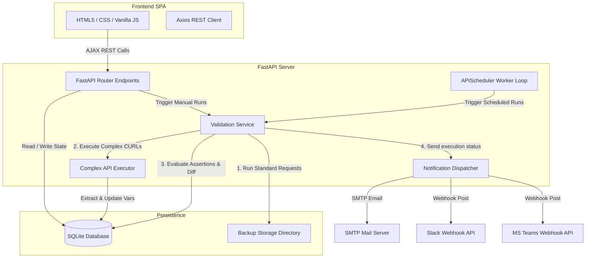

# 🕷️ API-Crawler Monitoring Suite

API-Crawler is a premium, lightweight, self-hosted API monitoring and regression validation suite built with a **FastAPI** backend and a responsive, modern **Vanilla JS + CSS** Single Page Application (SPA) frontend. It enables software teams to track changes in API responses over time, run complex multi-step request sequences, extract dynamic variables, assert custom conditions, schedule automatic validation jobs, and dispatch alerts to communication channels.

---

## 🏗️ Architecture

The application is structured into a decouple client-server model, utilizing a local SQLite database for state persistence and a background worker loop for time-slot cron execution.



### Key Workflow
1. **Dynamic Execution & Variable Extractions**: Complex API steps run sequential cURL commands. The JSON extractor rules parse response keys (using dot notation JSONPath) and store variables in `global_variables`.
2. **Autocomplete Variable Suggestions**: When typing `{{` in any URL endpoint, name, or assertion field in the UI, an autocomplete dropdown suggests the active global variable keys.
3. **Assertion Evaluations**: Validation runs compare standard API responses against baseline backups, while executing complex APIs against inline rules (e.g. status code, response time limits, header keys, JSON path matches, and full JSON Schemas).
4. **Excluded Environments**: Toggling the schedule switch off on any environment card immediately skips it from scheduled runs.

---

## ✨ Features

- 📊 **Dashboard Panels**: High-level visual metrics of environments, checked APIs, pass rates, pie charts, and detail views of execution history.
- 🗂️ **API Registry**: Manage standard API endpoints or configure complex multi-step cURL flows.
- 🔗 **CURL Sequences**: Run arbitrary HTTP requests using cURL notation.
- 🔄 **Extracted Variables**: Capture authentication tokens or IDs from response payloads and inject them dynamically as `{{var_name}}` in downstream requests and assertion values.
- 🚦 **Custom Assertions**: Assert response times, status codes, substrings, headers, JSON path equalities, or validate schemas using JSON Schema Draft 7.
- ⏱️ **Time-Slot Scheduler**: Add up to 100 card-based cron slots (e.g. `12:00 AM`, `2:35 AM`, `2:00 PM`) for daily recurring runs.
- 🔌 **Communication Channels**: Push execution reports containing run summaries and diff details to **Slack Webhooks**, **Microsoft Teams**, or **SMTP Email**.
- 🐳 **Dockerized Stack**: Fully ready Docker container orchestration setup with SQLite and baseline backups volume persistence.

---

## 🚀 Getting Started

### Prerequisites
- Python 3.10+ (if running locally)
- Docker & Docker Compose (preferred)

### Running with Docker Compose (Recommended)

1. Clone this repository to your target server or local workspace.
2. Launch the full environment in detached mode:
   ```bash
   docker-compose up --build -d
   ```
3. Open [http://localhost:8000](http://localhost:8000) in your browser.
4. Data is stored persistently in the database volume mapping.

### Running Locally (Development)

1. **Set up Virtual Environment**:
   ```bash
   python -m venv .venv
   source .venv/bin/activate  # On macOS/Linux
   # .venv\Scripts\activate  # On Windows
   pip install -r backend/requirements.txt
   ```
2. **Start Backend Server**:
   ```bash
   python -m uvicorn backend.app.main:app --host 127.0.0.1 --port 8000 --reload
   ```
3. **Access App**:
   Open [http://127.0.0.1:8000](http://127.0.0.1:8000) in your browser.

---

## 📖 How To Use

### Step 1: Configure Environments
1. Go to **Settings**.
2. Click **Configure Environment** under the Environment cards.
3. Input the **Name** and the **Base URL** (e.g. `https://jsonplaceholder.typicode.com`).
4. To enable scheduled validations for this environment, keep the **Schedule** toggle switched on. To exclude it from automatic background jobs, turn the toggle off.

### Step 2: Register API Endpoints
- **Standard APIs**: Go to **API Registry** -> click the **+ (FAB)** button. Register standard endpoint paths (e.g. `{{base_url}}/posts`).
- **Complex APIs**: Go to **Complex APIs** -> click **Add Complex API**. Paste your raw `cURL` command containing placeholder tags, add extraction rules (e.g. Extract `0.id` to variable `id_value`), and write custom assertion rules.
- **Using Variables**: In both URL paths, cURL commands (URL, headers, request bodies), and assertion values, you can reference variables using `{{var_name}}`. The backend resolves variables in this order:
  1. Checks the **Global Variables** table in the database.
  2. Falls back to the host machine or Docker container's **System Environment Variables** (`os.environ`).
  
  This allows referencing sensitive secrets like `{{SMTP_PASSWORD}}` or `{{API_TOKEN}}` securely without committing them to the database.

### Step 3: Run Validation Checks
- Click the **Validate Now** button at the top header to run checks across all registered APIs for the currently active environment.
- On completion, if differences in payloads or headers are detected, or assertions fail, a warning pop-up modal will show a full detailed side-by-side diff listing.

### Step 4: Schedule Runs & Configure Alerts
- In **Settings** -> **Scheduler Time Slots**, add names and times (e.g. `8:00 AM`, `9:15 PM`).
- In **Settings** -> **Communication Channels**, select your alert route (Email, Slack, or Teams), enter the configuration details, click **Test Connection** to verify, and save. Reports will be sent automatically.

---

## 📸 Screenshots

*Place your application screenshots here for documentation reference:*

#### 1. System Dashboard


#### 2. Complex API Variable Extractions


#### 3. Time-Slot Scheduler and Alerts


